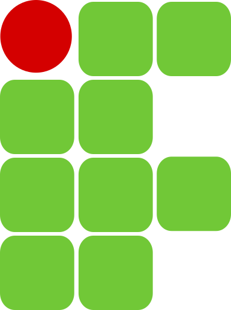
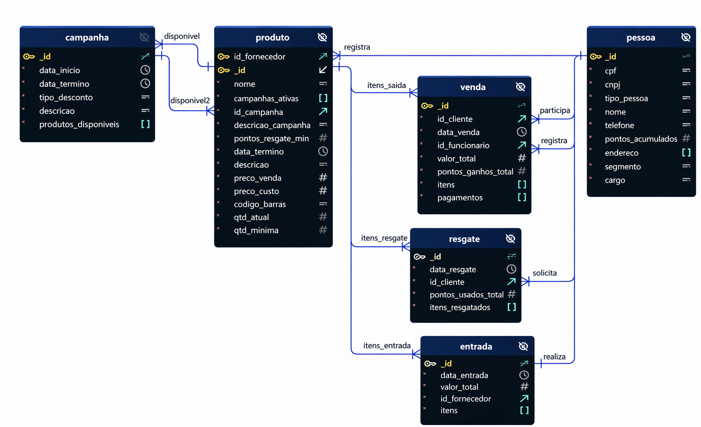

# Mercadinho São Miguel — Microsserviços, MCP e Chatbot 



<p>
  
  
  
  
  
  
  
  
  
  
</p>

Entrega final da avaliação da disciplina de **Desenvolvimento de Aplicações Orientadas a Serviços**, Pós Graduação em Desenvolvimetno WEB, no IFBA - Campus Vitória da Conquista.

O trabalho utiliza como base a entrega do trabalho da disciplina de [Programação WEB 1](https://github.com/pedrovitorsilva/trabalho-web-pos-01), refatorando um monolito em um sistema de 
microsserviços conteinerizados, conforme a proposta no [Documento de Orientações da Avaliação](./orient_servicos_avaliacao_descritivo.pdf).

## [Estrutura de pastas](./docs/estrutura_pastas.md)

O trabalho possui as seguintes composições:

## Etapa 1: Composição — Serviços web, banco e front-end

Contém a lógica principal da aplicação.

O projeto consiste em um sistema de mercado, que possui dados dos funcionários e clientes, além de dados dos produtos, vendas e estoque.

Além disso, o mercado possui um sistema de fidelização por pontos, que podem ser resgatados por produtos quando houver campanhas que possuam tais produtos.

O banco (não relacional) possui a seguinte estrutura:




| Contêiner         | Tecnologia      | Porta externa | Descrição                                |
| ----------------- | --------------- | :-----------: | ---------------------------------------- |
| `miguel-mongodb`  | MongoDB latest  |     7004      | Banco de dados compartilhado             |
| `miguel-produtos` | Node.js/Express |     7001      | API de Produtos, Entradas e Campanhas    |
| `miguel-pessoas`  | Node.js/Express |     7002      | API de Pessoas (Clientes e Funcionários) |
| `miguel-vendas`   | Node.js/Express |     7003      | API de Vendas e Resgates (fidelidade)    |
| `miguel-frontend` | Nginx + HTML/JS |     3000      | Painel web consumindo as 3 APIs          |

Cada microsserviço é um projeto Node.js independente, 
com o próprio `package.json`, `server.js` e a estrutura MVC herdada do projeto original 
(`models/` → `services/` → `controllers/` → `routes/`).

Todos os contêineres ficam na rede Docker externa `rede-mercadinho`, que a
composição 2 também usará.

---

## Etapa 2: Composição — Serviços MCP

Possui um contêiner Python/FastMCP para cada microsserviço, cada um expondo ferramentas MCP
que fazem requisições HTTP para o serviço Node.js correspondente usando o
**hostname interno do Docker** (ex: `miguel-produtos:8000`, não a porta
publicada 7001). Todos na mesma rede externa `rede-mercadinho` da Composição 1.

| Contêiner       | Porta externa | Descrição                               |
| --------------- | :-----------: | --------------------------------------- |
| `mcp-produtos`  |     8001      | Ferramentas MCP do serviço de Produtos  |
| `mcp-pessoas`   |     8002      | Ferramentas MCP do serviço de Pessoas   |
| `mcp-vendas`    |     8003      | Ferramentas MCP do serviço de Vendas    |

---

## Etapa 3 — Chatbot via Terminal

Um script Python que roda **localmente** (não em Docker) para fornecer uma
interface de chat interativa no terminal, conectando-se aos 3 serviços MCP
via HTTP e à API do Google Gemini para linguagem natural.

### Interface

- Interação via Terminal
- Comando de saída: `sair`, `exit`, `quit`, `tchau`
#### Fluxo de uma pergunta
1. Usuário digita uma pergunta no terminal
2. Chatbot envia a pergunta e a lista de ferramentas MCP disponíveis ao Gemini
3. Gemini decide se precisa chamar uma ferramenta MCP (ex: "listar_produtos")
4. O script chama a ferramenta via HTTP no respectivo serviço MCP
5. A ferramenta MCP faz uma requisição HTTP ao microsserviço Node.js correspondente
6. O resultado é retornado ao Gemini, que formula a resposta em linguagem natural

---

### Como subir a aplicação

A solução completa é composta por 3 etapas, cada uma com suas próprias dependências. Siga as etapas na ordem descrita abaixo:

#### **Etapa 1: Serviços Web, Banco de Dados e Front-end (Independente)**

**Localização da pasta:** `miguel_servicos/sao_miguel/`

**O que será executado:**
- Banco de dados MongoDB
- 3 APIs RESTful (Produtos, Pessoas, Vendas)
- Front-end Web para consumo das APIs

**Instruções de inicialização:**

Primeira execução — criar a rede compartilhada:
```bash
docker network create rede-mercadinho
```

Subir os serviços da Etapa 1:
```bash
cd miguel_servicos/sao_miguel/
docker compose up -d --build
```

**Validação — Serviços em funcionamento:**
- Painel web: <http://localhost:3000>
- API de Produtos: <http://localhost:7001/produtos>
- API de Pessoas: <http://localhost:7002/pessoa>
- API de Vendas: <http://localhost:7003/vendas>

**Parar os serviços da Etapa 1:**
```bash
cd miguel_servicos/sao_miguel/
docker compose down -v
```
*(Opção `-v` remove volumes e regenera dados na próxima execução)*

---

#### **Etapa 2: Serviços MCP (Depende da Etapa 1)**

**Localização da pasta:** `miguel_servicos/mcp_sao_miguel/`

**Pré-requisitos:**
- Rede Docker `rede-mercadinho` criada ✓
- Etapa 1 (serviços `miguel-*`) em execução ✓

**O que será executado:**
- 3 serviços MCP (Python/FastMCP)
- Cada serviço expõe ferramentas para consumo da IA

**Instruções de inicialização:**

Subir os serviços da Etapa 2:
```bash
cd miguel_servicos/mcp_sao_miguel/
docker compose up -d --build
```

**Validação — Serviços MCP em funcionamento:**
- MCP de Produtos disponível
- MCP de Pessoas disponível
- MCP de Vendas disponível

**Parar os serviços da Etapa 2:**
```bash
cd miguel_servicos/mcp_sao_miguel/
docker compose down
```

---

#### **Etapa 3: Chatbot via Terminal (Depende das Etapas 1 e 2)**

**Localização da pasta:** `miguel_servicos/cliente_mcp_sao_miguel/`

**Pré-requisitos:**
- Rede Docker `rede-mercadinho` criada ✓
- Etapa 1 (serviços `miguel-*`) em execução ✓
- Etapa 2 (serviços MCP `mcp-*`) em execução ✓
- Python 3.12.8+ com ambiente virtual `.venv/` configurado
- `.env` com `GOOGLE_API_KEY` para API do Gemini

**Configuração do arquivo `.env`:**

O arquivo `.env.example` contém um template com todas as variáveis de ambiente necessárias. Para inicializar o chatbot, copie `.env.example` para `.env` e insira sua chave da API do Google Gemini. A variável `GOOGLE_API_KEY` é obrigatória para que o chatbot funcione corretamente, permitindo a conexão com o modelo de IA.

**O que será executado:**
- Interface de chat interativa no terminal
- Conexão com os 3 serviços MCP
- Integração com IA (Google Gemini)

**Instruções de inicialização:**

```bash
cd miguel_servicos/cliente_mcp_sao_miguel
- (Instalar requisitos em requirements.txt localmente ou via .venv)
python chat_mercadinho.py
```

**Validação — Chatbot em funcionamento:**
- Prompt interativo aberto no terminal
- Aceita perguntas em linguagem natural
- Conecta com os serviços MCP disponíveis
- Comandos de saída: `sair`, `exit`, `quit`, `tchau`

